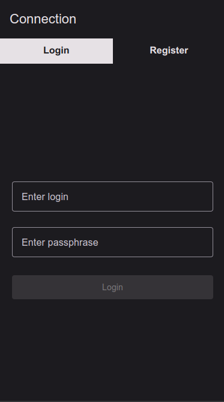
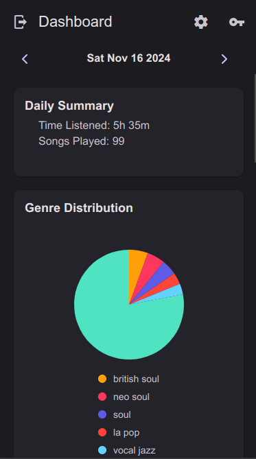
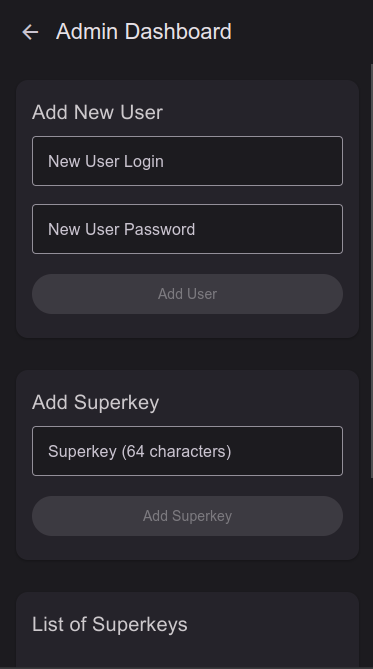
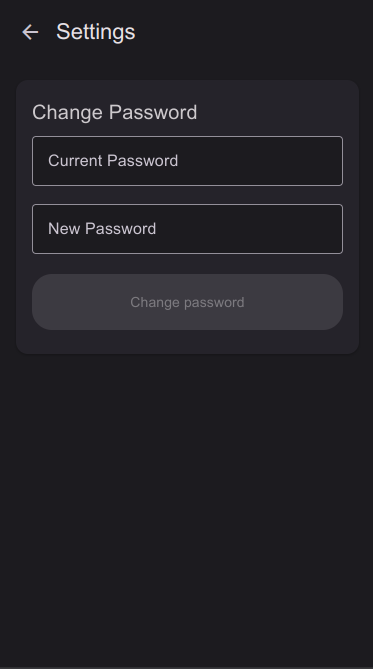

# Track My Tracks - Docker Setup

## Table of Contents

1. [Track My Tracks - Docker Setup](#track-my-tracks---docker-setup)
2. [Repositories](#repositories)
3. [Screenshots](#screenshots)
4. [Key Features](#key-features)
5. [Environment Variables](#environment-variables)
   1. [Frontend](#frontend)
   2. [Backend](#backend)
   3. [Worker](#worker)
6. [Building and Running the Application](#building-and-running-the-application)
7. [License](#license)

## Track My Tracks

**Track My Tracks** is a web-based application that tracks and visualizes your Spotify listening history. The app allows users to see detailed information about their listening habits, including total listening time, favorite genres, top artists, and a breakdown of their listening history.

This repository contains the Docker setup to run the entire app, including the frontend, backend, worker, and PostgreSQL database.

## Repositories

- **Main**: [Track My Tracks - Main Repository](https://github.com/FlorealRISSO/track-my-tracks)
- **Frontend**: [Track My Tracks - Frontend GitHub Repository](https://github.com/FlorealRISSO/track-my-tracks)
- **Backend**: [Track My Tracks - Backend GitHub Repository](https://github.com/FlorealRISSO/track-my-tracks-backend)

## Screenshots

- **Login Page**:
  

- **Home Page**:
  

- **Admin Page**:
  

- **Settings Page**:
  

## Key Features

- **Spotify Integration**: Seamlessly connects with the Spotify API to fetch your listening data, including track history, genres, and artists.
- **Real-Time Insights**: Provides a real-time breakdown of your Spotify listening habits, showing insights like total listening time, favorite artists, and genres.
- **Admin Dashboard**: Includes an admin dashboard to manage and monitor user activity, with an easy-to-navigate interface.
- **Cross-Platform Access**: The frontend is built with Expo React Native, making the app accessible on various platforms, including web, mobile, and desktop.

## Environment Variables

### Frontend

The frontend uses the following environment variables:

- **`BACKEND_URL`**: The URL of the backend API. Set this to the backend's address (e.g., `http://localhost:3000`).
- **`FRONTEND_URL`**: The URL of the frontend service. Typically, this will be `http://localhost:8080` for local development.

### Backend

The backend service uses the following environment variables:

- **`DB_URL`**: The PostgreSQL database connection string. Typically `postgres://admin:mypassword@db:5432/dev_db`.
- **`CLIENT_ID`**: The Spotify API client ID. You must provide your own client ID for the Spotify API integration ([Spotify Documentation](https://developer.spotify.com/documentation/web-api/concepts/apps)).
- **`CLIENT_SECRET`**: The Spotify API client secret. You must provide your own client secret for the Spotify API integration ([Spotify Documentation](https://developer.spotify.com/documentation/web-api/concepts/apps)).
- **`FRONTEND_URL`**: The URL of the frontend service. Typically `http://localhost:8080`.
- **`BACKEND_URL`**: The URL of the backend API. Typically `http://localhost:3000`.
- **`JWT_SECRET`**: A secret key for JWT authentication. You can set this to any random string to be used for signing tokens.
- **`APP_USER_ADMIN`**: The admin username for managing the application. This is the username used for logging into the admin panel.
- **`APP_USER_PASSPHRASE`**: The admin password for the application. This is the password for the admin user.

### Worker

The worker uses the following environment variables (similar to the backend):

- **`DB_URL`**: The PostgreSQL database connection string. Typically the same as in the backend, e.g., `postgres://admin:mypassword@db:5432/dev_db`.
- **`CLIENT_ID`**: The Spotify API client ID, used to authenticate the worker with Spotify.
- **`CLIENT_SECRET`**: The Spotify API client secret, used to authenticate the worker with Spotify.

## Building and Running the Application

To build and run the entire application using Docker, follow these steps:

1. **Clone the repository**:

   ```bash
   git clone https://github.com/FlorealRISSO/track-my-tracks.git
   cd track-my-tracks
   git submodule update --init --recursive
   ```

2. **Build and run the application**:
   To build and start the app, run the following command:

   ```bash
   docker-compose up --build
   ```

   This will:
   - Build the images for the frontend, backend, worker, and database.
   - Start the containers for all services.

3. **Access the application**:
   - The **frontend** will be available at `http://localhost:8080`.
   - The **backend** will be available at `http://localhost:3000`.

4. **Stop the services**:
   To stop and remove the containers, run:

   ```bash
   docker-compose down
   ```

## License

This project is licensed under the MIT License. See the [LICENSE](./LICENSE) file for details.
